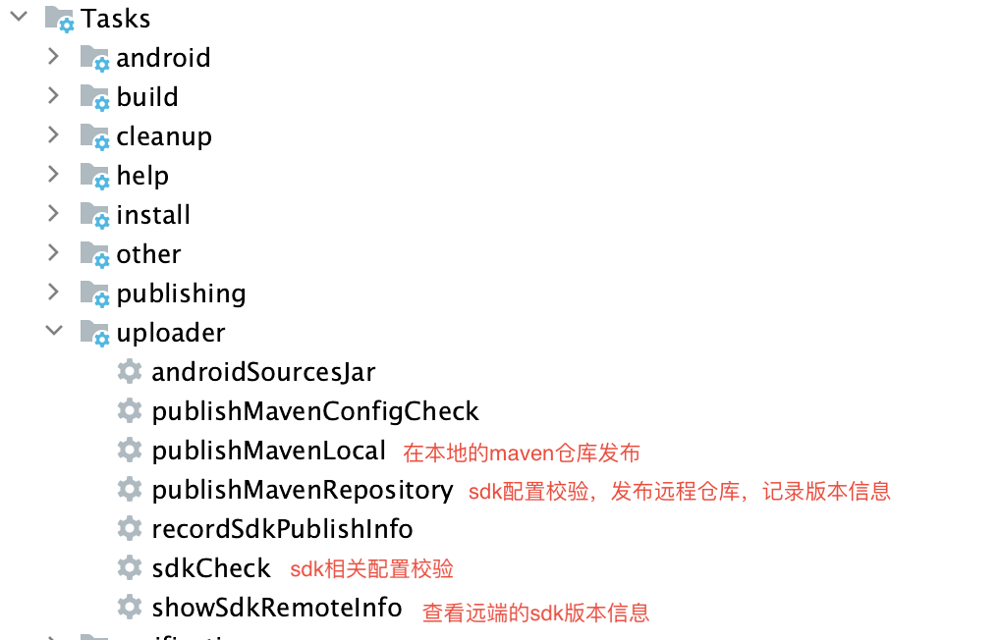
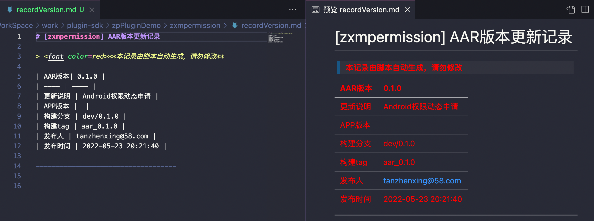

# PublishMaven是辅助开发者进行sdk打包上传maven服务的利器

基于`maven-publish`的`gradle`插件写的sdk上传利器。

主要解决我在开发sdk,plugin以及业务lib库过程中的一下问题：

1. 两个sdk版本之间到底是谁修改了什么？（sdk对应的版本号，版本开发者，版本描述）；
2. 这个sdk版本到底对于的代码是哪个`branch`或者`tag`或者`commit`？（sdk版本号对于的代码节点问题）
3. 一个sdk多个部门维护，版本号冲突怎么办？（自动校验远端已经发布的版本号，防止出现比线上跟小的版本）
4. sdk版本对于的代码在本地忘记push怎么办？（自动校验本地的sha和远端的sha是否相同）
5. sdk开发过程中不想频繁发布到远程仓库怎么办？（支持mavenLocal）


> ```目前支持`jar`和`aar`类型。```

`pom`文件中依赖仅支持一下类型：
1. `compileOnly`包含`provided`;
2. `implementation`包含`api`;
3. `debugImplementation`包含`debugCompile`;
4. `releaseImplementation`包含`releaseCompile`;

## 使用方法
`root project`的`build.gradle`添加依赖:
```groovy
buildscript {
    repositories {
        mavenLocal()
    	maven {
    	    url "http://artifactory.58corp.com:8081/artifactory/android-public/"
        }
    }
    dependencies {
        classpath 'com.wuba.hrg.plugins:PublishMaven:0.0.7'
    }
}
```

[PublishMaven的发版记录](recordVersion.md)


在需要进行操作的module的`build.gradle`文件添加一下相关的配置
```groovy
apply plugin: 'com.hrg.publishmaven'
publishMavenConfig {
    //组名
    groupId = 'com.wuba.hrg'
    //模块名称
    artifactId = 'zxmpermission'
    //版本号
    version = '0.1.0'
    //是否为快照版本
    isSnapshot = true
    //记录文件
    recordFileName = 'recordVersion.md'
    //当前版本的更新描述
    versionDescription = "Android权限动态申请bug修改"
    //需要上传的仓库地址
    repoUrl = "http://artifactory.58corp.com:8081/artifactory/android-local/"
    //需要上传的仓库账号
    repoName = ""
    //需要上传的仓库秘钥
    repoPassword = ""
    //pom文件相关内容
    pomName = "zxmpermission"
    pomDescription = "Unified distribution of Android permission requests"
    pomUrl = 'http://igit.58corp.com/HRG-Client/Android/zxmpermission.git '
    /***********部分参数可以省略***************/
}
```

|参数名称|必填|默认值|含义|
|:--|:--|:--|:--|
|groupId|✅|""|组名|
|artifactId|✅|""|模块名称|
|version|✅|""|版本号，eg:1.1.0|
|versionDescription|❌|""|版本描述，如果需要记录md文件，那么不能为空|
|appVersion|❌|""|对应当前app的版本号，部分业务sdk需要和app版本做match|
|recordFileName|❌|README.md|自动写入发布版本记录文件名|
|repoUrl|✅|""|maven仓库地址|
|repoName|❌|""|maven仓库用户名|
|repoPassword|❌|""|maven仓库密码|
|isSnapshot|❌|false|是否为快照版本|
|publishSource|❌|true|发布时是否包含源码|
|publishDocument|❌|true|发布正式版本时是否记录md文档|
|publishSnapshotDocument|❌|false|发布快照版本时是否记录md文档|





## 异常介绍

1. `"Build for publishMaven must dependency archives(jar or aar), but has a Project:`，有源码依赖；
2. `dependencies publish maven plugin should library~!~!`,该插件是适与`Library`库的开发；
3. `publish info groupId,artifactId,version is empty~!`，`publishMavenConfig`必要字段配置不全；
4. `publish release repoUrl isn't match url~!~!`,发布正式版本必要有对应的`maven`仓库地址；
5. `recordFile not a File!!! path -->`，版本记录配置不是一个可写的文件；
6. `fatal: tag 'aar_0.1.0_SNAPSHOT' already exists`，快照版本的tag只能打一个，所以在写入相同版本的快照的发版文档的时候快照版本自动生成tag会校验失败。
